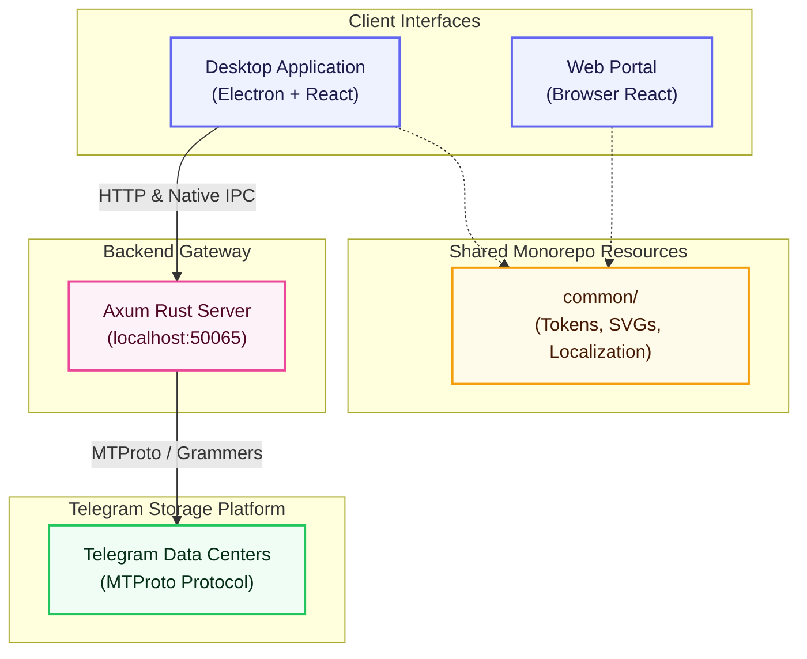
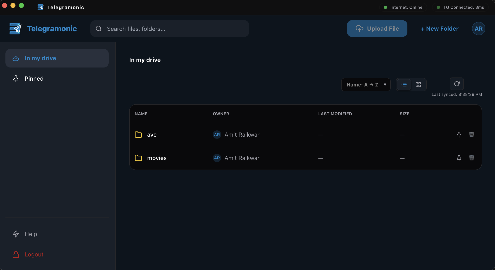
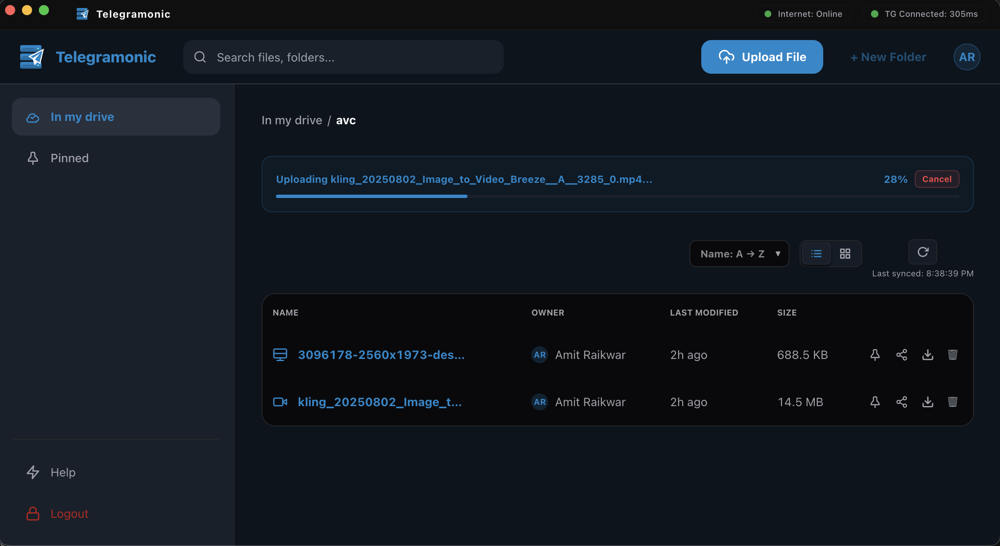
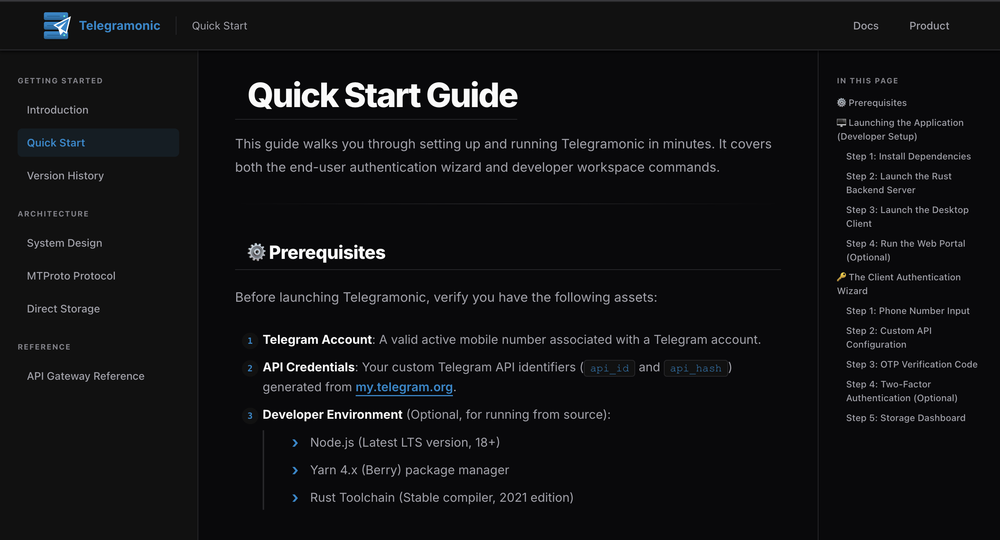

# Telegramonic

**Telegramonic** is a high-performance, minimalist cloud storage solution for digital craftsmen, developers, and tech professionals. The platform provides a fast, secure, and ergonomic workspace to organize and manage digital assets.

## System Architecture



---

## Showcase

### 🖥️ Desktop Application




### 🌐 Web Portal





---

## Table of Contents

- [Core Technology Stack](#core-technology-stack)
- [Monorepo Structure](#monorepo-structure)
- [Design System](#design-system)
- [Getting Started](#getting-started)
- [Authentication Wizard](#authentication-wizard)
- [Direct File Streaming](#direct-file-streaming)
- [Infrastructure](#infrastructure)

---

## Core Technology Stack

- **Framework**: [React 18+](https://reactjs.org/)
- **UI Library**: [Chakra UI v3](https://chakra-ui.com/)
- **State Management**: [Zustand v5](https://zustand-demo.pmnd.rs/) + [TanStack Query v5](https://tanstack.com/query/latest)
- **Forms**: [TanStack Form v1](https://tanstack.com/form/latest)
- **Routing**: [React Router v7](https://reactrouter.com/)
- **Styling**: [Panda CSS](https://panda-css.com/) (Chakra UI v3 underlying engine)
- **Animations**: [Framer Motion](https://www.framer.com/motion/)
- **Language**: [TypeScript 5.x](https://www.typescriptlang.org/)
- **Testing**: [Jest](https://jestjs.io/) & [React Testing Library](https://testing-library.com/)
- **Backend**: [Rust](https://www.rust-lang.org/) via [Axum](https://github.com/tokio-rs/axum) (HTTP bridge to Telegram MTProto)
- **Desktop Shell**: [Electron](https://www.electronjs.org/)
- **Package Manager**: [Yarn 4.x (Berry)](https://yarnpkg.com/)

---

## Monorepo Structure

The monorepo contains four distinct workspaces:

```
telegramonic/
├── common/          # Shared utilities (design tokens, icons, translations, test utils)
├── desktop/         # Electron desktop app containing core file management and login
│   ├── main.js      # Electron main entry script (frameless, 80% screen dimensions)
│   ├── preload.js   # Secure API/diagnostics bridge
│   └── src/
│       ├── components/         # Desktop-specific components (Icon, Logo)
│       ├── providers/          # App-level providers (Chakra, Router, Query, Modal)
│       ├── routes/             # Desktop routing and lazy-loaded screens
│       ├── screens/
│       │   ├── dashboard/      # Decomposed file explorer UI
│       │   └── loginPage/      # Multi-step login flow wizard
│       ├── services/
│       │   ├── apiClient.ts    # HTTP client for Rust server (port 50065)
│       │   ├── hooks.ts        # TanStack Query custom hooks for backend integration
│       │   ├── types.ts        # API type definitions
│       │   └── const.ts        # API routes constants
│       └── store/              # Zustand stores (app credentials, UI modals)
├── web/             # React web application (marketing portal, download page, docs viewer)
│   └── src/
│       ├── providers/          # UI-level providers (Theme, Localization, Query)
│       ├── routes/             # Routing and lazy-loaded screen paths
│       └── screens/
│           ├── landingPage/    # Main landing and OS-detection download screen
│           ├── DocsPage/       # Documentation viewer with sidebar navigation
│           └── MdPage/         # Legal page renderer (privacy, terms, disclaimer)
└── server/          # Rust/Axum HTTP server (MTProto gateway, default port: 50065)
```

For detailed setup, configuration, features, and API routing of each workspace, see the module-specific README documentation:

- 🖥️ **[Desktop Application README](file:///Users/mr.robot/z-stash/telegramonic/telegramonic/desktop/README.md)**: Electron shell configurations, preload API interfaces, streaming direct-to-disk downloads, and platform packaging scripts.
- 🌐 **[Web Portal README](file:///Users/mr.robot/z-stash/telegramonic/telegramonic/web/README.md)**: Browser-only client setup, localized string files, routes, and browser E2E test commands.
- ⚙️ **[Rust Backend Server README](file:///Users/mr.robot/z-stash/telegramonic/telegramonic/server/README.md)**: Axum endpoint details, MTProto integration details via Grammers, in-memory caches, and mock-based testing suites.

---

## Design System

The application implements a custom **Modern Corporate / Utility Minimalism** design system using the `Inter` typeface:

- **Colors**: Telegram Blue (`#0088CC`) accent and Deep Charcoal (`#212529`) typography.
- **Surfaces**: Tiered gray canvas (`#F8F9FA`) with white container cards (`#FFFFFF`) and thin boundaries (`#E9ECEF`).
- **Radius**: 8px borders for buttons/inputs and 16px borders for modals/panels.
- **Themes**: Automatic dark and light mode synchronization based on system settings.

---

## Getting Started

### Prerequisites

- Node.js (Latest LTS)
- Yarn 4.x
- Rust toolchain (stable, for server)

### Installation

```bash
yarn install
```

### Development

```bash
# Run Electron desktop app (React UI)
yarn desktop:start

# Run Rust server backend (required for API calls)
yarn server:start

# Run web React application (browser-only mode)
yarn web:start
```

> **Note:** The desktop app connects to the Rust server at `http://localhost:50065`. Ensure the server is running when developing/running the desktop client.

### Build

```bash
# Build web React application
yarn web:build

# Build Rust server backend
yarn server:build

# Build and package Electron desktop application
yarn desktop:dist:mac          # Generate macOS installer packages (DMG & Zip)
yarn desktop:dist:win          # Generate Windows installer packages (NSIS & Zip)
yarn desktop:dist:linux        # Generate Linux packages (deb & AppImage)
yarn desktop:dist:all          # Package for all desktop platforms concurrently

# Build React UI for both web and desktop components together
yarn build:all

# Package React UI and desktop apps for all targets together
yarn dist:all
```

### Testing

```bash
# Run Jest unit tests for the desktop app
yarn desktop:test

# Run Jest tests for web
yarn web:test

# Run Jest tests specifically for common workspace
yarn common:test

# Run Cargo tests for Rust server
yarn server:test

# Run tests with coverage for web
yarn workspace telegramonic-web test:cov

# Open Cypress for E2E testing
yarn workspace telegramonic-web cy:open

# Run tests on staged git changes (pre-commit)
yarn run-staged-tests

# Run tests on committed/pushed git changes (CI)
yarn run-pushed-files-tests
```

#### Test Structure

Tests are co-located with their source in `__tests__/` folders:

| Folder                                    | What's tested                                                                                                       |
| ----------------------------------------- | ------------------------------------------------------------------------------------------------------------------- |
| `screens/dashboard/__tests__/`            | `Dashboard` integration test                                                                                        |
| `screens/dashboard/components/__tests__/` | `TopNavBar`, `SideNavBar`, `Breadcrumbs`, `FilesTable`, `SuggestedSection`, `UploadProgressBanner`, `const` helpers |
| `screens/loginPage/__tests__/`            | `LoginPage` flow, `COUNTRIES` constant                                                                              |
| `services/`                               | `apiClient`, `hooks`                                                                                                |
| `store/app/`, `store/ui/`                 | Zustand selectors and slices                                                                                        |
| `providers/`                              | Each provider wrapper                                                                                               |

### Linting & Formatting

```bash
# Run ESLint for web
yarn workspace telegramonic-web lint

# Format code with Prettier
yarn workspace telegramonic-web run prettier:write
```

---

## Authentication Wizard

The desktop login workflow is structured as a 4-step wizard:

1. **Phone Number**: Enter your mobile number (includes country code selector).
2. **API Credentials**: Submit your Telegram `api_id` and `api_hash` (from [my.telegram.org](https://my.telegram.org)).
3. **OTP Verification**: Enter the 5-digit code received via Telegram.
4. **Success**: Displays a brief completion animation before loading the dashboard.

Navigation icons allow users to return to previous steps during inputs.

---

## Direct File Streaming

The desktop client bypasses Chromium's standard download manager to avoid leaving temporary system quarantine files (e.g. `.com.github.Electron.xxxxx`) in local directories:

1. **IPC Invocation**: The React renderer invokes `download-file-directly` via `contextBridge`.
2. **Save Dialog**: The Electron process prompts the user with a native file-save modal.
3. **Stream-to-Disk**: Chunks are piped directly from the Rust backend to the disk target, avoiding memory bottlenecks.
4. **Cleanup**: Incomplete downloads due to failure or cancellation are immediately deleted.
5. **Web Limitation**: The browser-only web portal is a static marketing and documentation page and does not manage files or connect to the storage backend.

---

## Infrastructure

- **Deployment**: Automated build, test, lint, and FTP deployment via GitHub Actions.
- **Localization**: Dynamic translation handling via `i18next` localized schemas.
- **Connectivity**: Automated health polls to `/health` every 5 seconds to show active connection states.
- **State Caching**: Query caching via TanStack Query prevents duplicate server calls.
