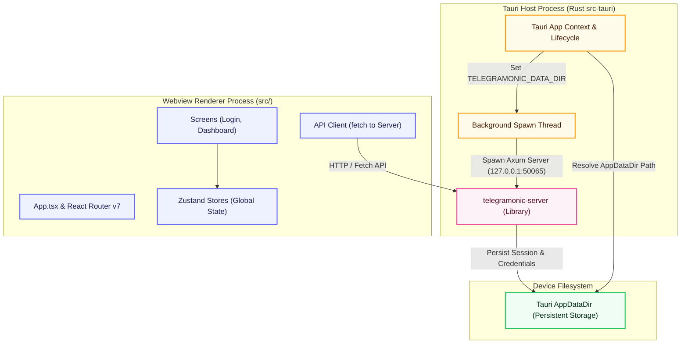

# Telegramonic Mobile Client (`apps/mobile/`)

The mobile client for **Telegramonic**—a React-based user interface wrapped in a **Tauri** mobile shell for iOS and Android. It shares state management, screens, logic, and assets with the web and desktop clients, while spawning a background Rust Axum server directly on the mobile device to interact with Telegram's MTProto API.

## Architecture Diagram



---

## Table of Contents

- [Features](#features)
- [Showcase](#showcase)
- [Directory Structure](#directory-structure)
- [Tech Stack & Dependencies](#tech-stack--dependencies)
- [How It Works](#how-it-works)
- [Getting Started](#getting-started)
- [Essential Commands](#essential-commands)
- [Testing](#testing)

---

## Features

- **Unified Cross-Platform Core**: Reuses the core components, styling, routing, and store modules from `shared/client-common` and `shared/common` workspaces.
- **Embedded Local Backend**: Spawns the Axum Rust server directly inside a Tauri-managed background thread, providing local MTProto client capabilities on the mobile device without external server dependencies.
- **Persistent App Data**: Resolves platform-specific AppData paths on iOS and Android to save credentials and session files securely.
- **Tailored Mobile Layout**: Renders using Chakra UI with touch-friendly navigation, scroll zones, and responsive inputs.
- **Adaptive Android Icons**: Configured with vector layer graphics scaling to prevent cropping across diverse vendor launchers.
- **Unified Testing**: Runs unit tests via Jest for UI components and Rust unit tests for native binding logic.

## Showcase


---

## Directory Structure

```
apps/mobile/
├── src/
│   ├── App.tsx             # Root React component, routing, and provider configuration
│   ├── index.tsx           # React DOM bootstrap file loading React 18
│   ├── index.css           # Global Tailwind and font styles
│   ├── md_rules.d.ts       # Types for markdown rules
│   └── __tests__/          # Mobile specific unit tests
├── src-tauri/
│   ├── src/
│   │   ├── main.rs         # Tauri application main entry point
│   │   └── lib.rs          # Bootstrap logic (resolving AppData, setting environment, spawning Axum)
│   ├── Cargo.toml          # Rust dependency configuration (patches core2 dependency)
│   ├── tauri.conf.json     # Tauri configuration (bundle settings, permissions, app branding)
│   ├── capabilities/       # Tauri security and plugin permission configurations
│   └── icons/              # Platform specific adaptive launcher icons
├── icon_manifest.json      # Rules for Android fg/bg colors and scaling for icon generation
├── craco.config.js         # Custom webpack, babel, and CRA override configuration
├── jest.config.js          # Testing suite configuration for Jest
└── package.json            # Mobile package dependencies and development scripts
```

---

## Tech Stack & Dependencies

| Dependency / Tool       | Version  | Purpose                                              |
| :---------------------- | :------- | :--------------------------------------------------- |
| `tauri`                 | ^2.0.0   | Native mobile/desktop wrapper framework              |
| `@tauri-apps/api`       | ^2.0.0   | JS bindings for communicating with the Rust shell    |
| `react` / `react-dom`   | ^18.3.1  | Rendering engine for the user interface              |
| `react-router-dom`      | ^7.15.0  | Dynamic page routing and navigation                  |
| `@chakra-ui/react`      | ^3.19.1  | Component design system                              |
| `@tanstack/react-query` | ^5.51.23 | Server state caching and sync                        |
| `telegramonic-server`   | *local*  | Embedded Axum Rust server library                    |
| `jest` / `ts-jest`      | ^29.7.0  | Unit and snapshot testing suites                     |

---

## How It Works

### Embedded Server Spawning & Data Persistence

Upon application startup, the Tauri native bootstrap code (located in [apps/mobile/src-tauri/src/lib.rs](file:///Users/mr.robot/z-stash/telegramonic/telegramonic/apps/mobile/src-tauri/src/lib.rs)) queries the sandboxed operating system for the persistent application data directory (e.g. `AppDataDir` on Android / Library path on iOS).
It exposes this directory path as the `TELEGRAMONIC_DATA_DIR` environment variable, then spawns the local Axum HTTP server (`telegramonic-server`) on a background Tokio task. The server listens on `127.0.0.1:50065`, and uses the environment variable path to read and write the `telegram.session` and `telegram.credentials` configurations securely.

### Transitive Dependency Patch

To resolve crates.io yanking errors with the `core2 v0.4.0` dependency (required transitively by `glass_pumpkin` which is used by `grammers-crypto`), the [Cargo.toml](file:///Users/mr.robot/z-stash/telegramonic/telegramonic/apps/mobile/src-tauri/Cargo.toml) includes a direct git branch patch:
```toml
[patch.crates-io]
core2 = { git = "https://github.com/bbqsrc/core2", commit = "545e84bc..." }
```

---

## Getting Started

### Prerequisites

Before running or building the mobile applications, ensure your machine is configured with the necessary native build tools:

#### iOS Prerequisites
1. **Xcode**: Install Xcode from the Mac App Store and ensure Xcode Command Line Tools are active:
   ```bash
   xcode-select --install
   ```
2. **CocoaPods**: Required for managing native iOS dependencies:
   ```bash
   brew install cocoapods
   ```
3. **Rust Targets**: Add iOS cross-compilation targets:
   ```bash
   rustup target add aarch64-apple-ios x86_64-apple-ios aarch64-apple-ios-sim
   ```

#### Android Prerequisites
*Assuming **Android Studio** is already installed (which manages the SDK and emulator), the following additional configuration steps are required:*

1. **Android NDK**: Open Android Studio's SDK Manager (Tools > SDK Manager > SDK Tools), check **NDK (Side by side)**, and install NDK version `26.3.11579264`.
2. **Rust Targets**: Add the Android targets for cross-compilation:
   ```bash
   rustup target add aarch64-linux-android x86_64-linux-android
   ```
3. **Environment Variables**: Add the SDK and NDK paths to your shell configuration profile (e.g., `~/.zshrc`):
   ```bash
   export ANDROID_HOME="$HOME/Library/Android/sdk"
   export NDK_HOME="$ANDROID_HOME/ndk/26.3.11579264"
   ```

> [!TIP]
> You can automatically install the Rust iOS targets, CocoaPods, and JavaScript dependencies by running the setup script from the monorepo root:
> ```bash
> bash scripts/setup.sh
> ```

### Running the iOS App in Simulator

Follow these steps to build and launch the iOS application on the local simulator:

#### 1. Boot the Simulator
The Simulator must be active and booted before Tauri can deploy the application.
1. Launch the macOS Simulator application:
   ```bash
   open -a Simulator
   ```
2. Check available simulators and boot one if needed (for example, **iPhone 16**):
   * *List devices:* `xcrun simctl list devices`
   * *Boot device:* `xcrun simctl boot <SIMULATOR_UDID>`

#### 2. Start the Development Build
Run the following command from the monorepo root:
```bash
yarn workspace telegramonic-mobile run tauri ios dev
```

* **Interactive Mode**: If you do not specify a device, the CLI will output a list of detected simulators. Enter the index number corresponding to your booted simulator.
* **Targeted Mode**: You can directly target a booted simulator by passing its name or UDID:
  ```bash
  yarn workspace telegramonic-mobile run tauri ios dev "iPhone 16"
  ```

Once launched, the Tauri dev runner will boot your Craco development server, compile the Rust crate, assemble the Xcode workspace under `src-tauri/gen/apple`, install the `.app` package on your booted simulator, and automatically open it.

### Running and Building the Android App

#### Initialize Android Project
If compiling Android for the first time, make sure the project structure is initialized:
```bash
yarn workspace telegramonic-mobile run tauri android init
```

#### Run on Emulator or Connected Device
Make sure an Android Virtual Device (AVD) is running or a physical device with USB debugging enabled is connected, then run:
```bash
yarn workspace telegramonic-mobile run tauri android dev
```

#### Build APK (Debug or Release)
To compile a debug APK for testing:
```bash
yarn workspace telegramonic-mobile run tauri android build --apk --debug
```

The compiled APK will be output to:
`apps/mobile/src-tauri/gen/android/app/build/outputs/apk/universal/debug/app-universal-debug.apk`

---

## Essential Commands

Execute these commands from the monorepo root:

| Command | Description |
| :--- | :--- |
| `yarn mobile:dev` | Start the development server (web browser preview). |
| `yarn mobile:ios` | Compile and run the iOS app on a Simulator (interactive selector). |
| `yarn mobile:ios:build` | Build the production/distribution-ready iOS application bundle. |
| `yarn mobile:android` | Compile and run the Android app in development on an emulator. |
| `yarn mobile:android:build` | Build the production/distribution-ready Android app. |
| `yarn mobile:test` | Run the Jest unit tests for the mobile workspace. |

---

## Testing

Tests are written in Jest and React Testing Library for the frontend components.

```bash
# Run Jest unit and snapshot tests
yarn workspace telegramonic-mobile run test

# Run tests with coverage output
yarn workspace telegramonic-mobile run test:cov
```
