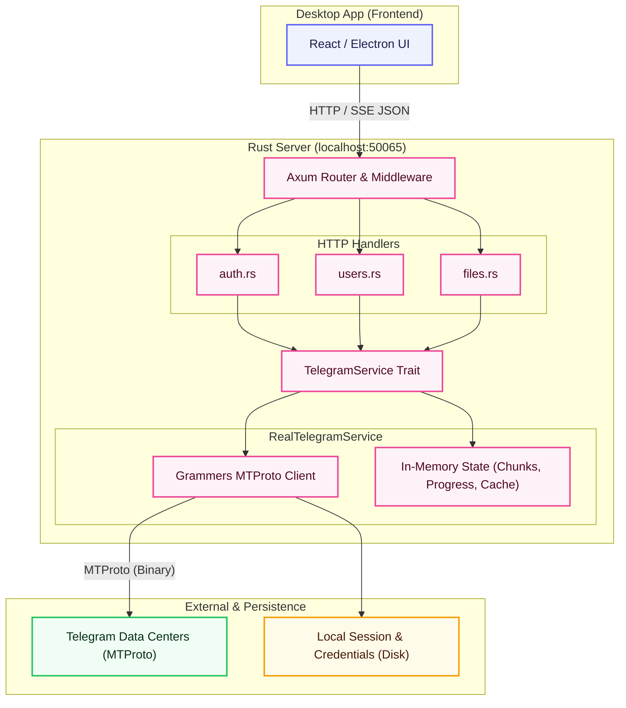

# Telegramonic Rust Server (`apps/server/`)

Backend for **Telegramonic**—an async Rust HTTP server built with **Axum** and **Tokio**. It acts as an MTProto gateway, bridging the React/Electron frontend to Telegram via the **Grammers** client library. All operations (auth, storage, drives) are exposed as JSON REST endpoints on `localhost:50065`.

## Architecture Diagram



---

## Table of Contents

- [Directory Structure](#directory-structure)
- [Tech Stack & Dependencies](#tech-stack--dependencies)
- [How It Works](#how-it-works)
- [Getting Started](#getting-started)
- [Configuration](#configuration)
- [API Reference](#api-reference)
- [Data Models](#data-models)
- [Authentication Flow](#authentication-flow)
- [File Upload / Download Flow](#file-upload--download-flow)
- [State Management](#state-management)
- [Persistence](#persistence)
- [Testing](#testing)
- [Logging & Tracing](#logging--tracing)

---

## Directory Structure

```
apps/server/
├── src/
│   ├── main.rs              # Standalone binary entry point: bootstraps tracing, config, service, and Axum server
│   ├── lib.rs               # Library entry point: encapsulates server logic for embedding in Tauri/Mobile clients
│   ├── config.rs            # AppConfig — reads HOST/PORT from environment variables
│   ├── handlers/            # Axum route handlers (HTTP layer)
│   │   ├── mod.rs           # Router factory (create_router), CORS setup, auth middleware
│   │   ├── auth.rs          # Authentication handlers (send-code, sign-in, check-password, log-out)
│   │   ├── users.rs         # User/account handlers (get-me, update-profile, etc.)
│   │   ├── files.rs         # File and drive handlers (upload, download, list, delete, SSE stream)
│   │   └── __tests__/       # Integration tests for all handlers (using MockTelegramService)
│   │       ├── mod.rs       # Test router setup helpers (setup_app, post_json, get_json)
│   │       ├── auth.test.rs
│   │       ├── files.test.rs
│   │       ├── users.test.rs
│   │       └── mock_service.rs  # In-memory mock implementing TelegramService trait
│   └── services/            # Business logic / Telegram client layer
│       ├── mod.rs           # TelegramService trait + shared data types + serde helpers
│       └── telegram.rs      # RealTelegramService: full Grammers MTProto implementation
├── testing/
│   ├── README.md            # Docs for the integration test shell script
│   └── test_real_api.sh     # Interactive shell script for live end-to-end API testing
├── Cargo.toml               # Rust package manifest and dependency versions
├── Cargo.lock               # Locked dependency tree
├── package.json             # Yarn workspace shim (start / build / test scripts)
├── telegram.session         # Grammers binary session file (auto-created on first login, gitignored)
└── telegram.credentials     # Saved api_id + api_hash (auto-created on sign-in, gitignored)
```

---

## Tech Stack & Dependencies

| Crate                  | Version | Purpose                                             |
| :--------------------- | :------ | :-------------------------------------------------- |
| `axum`                 | 0.7.4   | Async HTTP web framework (routing, extractors, SSE) |
| `tokio`                | 1.36.0  | Async runtime (`full` features)                     |
| `tower-http`           | 0.5.1   | CORS middleware and HTTP tracing layer              |
| `serde` / `serde_json` | 1.0     | JSON serialization and deserialization              |
| `uuid`                 | 1.7.0   | UUID v4 generation                                  |
| `chrono`               | 0.4.35  | Timestamps and RFC3339 date formatting              |
| `futures-util`         | 0.3.30  | Stream combinators (used for SSE upload progress)   |
| `tracing`              | 0.1.40  | Instrumentation/spans for structured logging        |
| `tracing-subscriber`   | 0.3.18  | Log formatting with env-filter support              |
| `grammers-client`      | 0.7.0   | High-level async Telegram MTProto client            |
| `grammers-session`     | 0.7.0   | Session file persistence for Grammers               |
| `grammers-tl-types`    | 0.7.0   | Raw TL (Type Language) function invocations         |
| `md5`                  | 0.7.0   | MD5 checksum for small file upload verification     |
| `tower` _(dev)_        | 0.4.13  | `ServiceExt::oneshot` for handler integration tests |

**Language / Edition**: Rust 2021

---

## How It Works

The server runs in **Real Mode**, connecting to Telegram's official Data Centers using MTProto via Grammers. Mocking is only used in unit tests via `MockTelegramService`.

### Standalone Binary vs. Embedded Library

The crate exposes two build targets:

1. **Standalone Binary** (`[[bin]]` target in `Cargo.toml` compiled from `src/main.rs`):
   - Bootstraps tracing, CORS, configuration, and runs the Axum server directly on the host machine.
   - Used during development (via `yarn server:start`) and when packaging the desktop client.
2. **Embedded Library** (`[lib]` target in `Cargo.toml` compiled from `src/lib.rs`):
   - Packages the server initialization logic and routes so it can be dynamically linked and called by other Rust packages.
   - Imported directly by the mobile client (`apps/mobile/src-tauri`) to run the Axum server in a background thread on iOS and Android devices, exposing backend endpoints locally on the device (`127.0.0.1:50065`).

**Request lifecycle:**

1. Client sends an HTTP request to `localhost:50065`.
2. Axum router matches the route and invokes a handler in `handlers/`.
3. Handler calls the `TelegramService` trait method via `Arc<dyn TelegramService>`.
4. `RealTelegramService` executes the MTProto or in-memory operation.
5. Handler returns the JSON response.

**Protected routes** (non-auth) use the `require_login` middleware, returning `401 Unauthorized` if the session state is not `LoggedIn`.

---

## Getting Started

### Prerequisites

- [Rust toolchain](https://rustup.rs/) (stable, 2021 edition)
- Telegram `api_id` and `api_hash` from [my.telegram.org/apps](https://my.telegram.org/apps)

### Install Rust

```bash
# macOS / Linux
curl --proto '=https' --tlsv1.2 -sSf https://sh.rustup.rs | sh
source $HOME/.cargo/env
```

### Run the Server

```bash
# From the monorepo root (recommended)
yarn server:start

# Or directly from the apps/server/ directory
cd apps/server/
cargo run
```

The server will start on `http://127.0.0.1:50065` by default.

> **Note:** API credentials (`api_id`, `api_hash`) are submitted dynamically during login and are not needed at startup.

### Build for Production

```bash
# From the monorepo root
yarn server:build

# Or directly
cd apps/server/
cargo build --release
```

---

## Configuration

Configuration is read from environment variables or a `.env` file in `apps/server/`:

| Variable   | Description                                     | Default                                     |
| :--------- | :---------------------------------------------- | :------------------------------------------ |
| `PORT`     | TCP port the HTTP server listens on             | `50065`                                     |
| `HOST`     | Bind address                                    | `127.0.0.1`                                 |
| `RUST_LOG` | Log level filter (e.g. `debug`, `info`, `warn`) | `telegramonic_server=info,tower_http=debug` |

**Example `.env`:**

```env
PORT=50065
HOST=127.0.0.1
RUST_LOG=telegramonic_server=debug
```

---

## API Reference

All endpoints return JSON. Large 64-bit integer IDs (`i64`) are serialized as **strings** to avoid JavaScript precision loss.

### Route Summary

| Method | Path                                                                                  | Auth Required | Description                           |
| :----- | :------------------------------------------------------------------------------------ | :-----------: | :------------------------------------ |
| `GET`  | `/health`                                                                             |      No       | Server health check                   |
| `GET`  | `/auth/state`                                                                         |      No       | Current auth state                    |
| `POST` | `/auth/send-code`                                                                     |      No       | Request OTP to phone                  |
| `POST` | `/auth/sign-in`                                                                       |      No       | Submit OTP code                       |
| `POST` | `/auth/sign-up`                                                                       |      No       | Alias for sign-in                     |
| `POST` | `/auth/check-password`                                                                |      No       | Submit 2FA password                   |
| `POST` | `/auth/log-out`                                                                       |    **Yes**    | Sign out and clear session            |
| `POST` | `/auth/update-credentials`                                                            |    **Yes**    | Update Telegram API credentials       |
| `POST` | `/auth/reset-authorization`                                                           |      No       | Force-clear client state              |
| `GET`  | `/users/me`                                                                           |    **Yes**    | Get authenticated user profile        |
| `GET`  | `/users/get-users`                                                                    |    **Yes**    | Get contacts (returns self)           |
| `GET`  | `/users/get-full-user?id=<i64>`                                                       |    **Yes**    | Get full user by ID                   |
| `POST` | `/account/update-profile`                                                             |    **Yes**    | Update first/last name                |
| `POST` | `/account/update-status`                                                              |    **Yes**    | Set online/offline status             |
| `POST` | `/account/update-username`                                                            |    **Yes**    | Change username                       |
| `GET`  | `/account/get-password`                                                               |    **Yes**    | Get 2FA password settings             |
| `GET`  | `/contacts/get-contacts`                                                              |    **Yes**    | Get contacts (stub, returns `[]`)     |
| `GET`  | `/contacts/search`                                                                    |    **Yes**    | Search contacts (stub, returns `[]`)  |
| `POST` | `/contacts/import-contacts`                                                           |    **Yes**    | Import contacts (stub)                |
| `GET`  | `/drive/list`                                                                         |    **Yes**    | List Telegram channels as drives      |
| `GET`  | `/drive/stats`                                                                        |    **Yes**    | Storage statistics                    |
| `GET`  | `/drive/folders?parent_id=<i64>`                                                      |    **Yes**    | List folders (channels at root level) |
| `GET`  | `/drive/files?folder_id=<i64>&q=<str>&all=<bool>`                                     |    **Yes**    | List files in a drive/folder          |
| `POST` | `/drive/folders/create`                                                               |    **Yes**    | Create folder / Telegram channel      |
| `POST` | `/drive/folders/delete`                                                               |    **Yes**    | Delete folder / leave channel         |
| `POST` | `/files/upload-part?file_id=<i64>&part_index=<i32>&file_size=<i64>&total_parts=<i32>` |    **Yes**    | Upload a raw binary chunk             |
| `POST` | `/files/save-file`                                                                    |    **Yes**    | Finalize and send file to Telegram    |
| `GET`  | `/files/download?file_id=<i64>`                                                       |    **Yes**    | Download file bytes                   |
| `GET`  | `/files/get-file?file_id=<i64>`                                                       |    **Yes**    | Alias for download                    |
| `POST` | `/files/delete`                                                                       |    **Yes**    | Delete file from Telegram             |
| `GET`  | `/files/upload-progress?file_id=<i64>`                                                |    **Yes**    | Poll upload progress (0–100)          |
| `GET`  | `/files/upload-progress/stream?file_id=<i64>`                                         |    **Yes**    | SSE stream of upload progress         |

---

### Endpoint Details

#### `GET /health`

Returns server status.

```json
{ "status": "ok" }
```

---

#### `GET /auth/state`

Returns current session state for login detection.

**Response variants:**

```json
{ "status": "LoggedOut" }
```

```json
{
  "status": "AwaitingCode",
  "data": { "phone": "+91...", "phone_code_hash": "..." }
}
```

```json
{ "status": "AwaitingPassword", "data": { "phone": "+91..." } }
```

```json
{ "status": "LoggedIn" }
```

---

#### `POST /auth/send-code`

Requests an OTP to the phone number and resets existing connections.

**Request body:**

```json
{
  "phone": "+919876543210",
  "api_id": "12345678",
  "api_hash": "abcdef1234567890abcdef1234567890"
}
```

**Response:**

```json
{ "success": true, "next_step": "code" }
```

---

#### `POST /auth/sign-in`

Submits the OTP code. Returns `next_step: "password"` if 2FA is active.

**Request body:**

```json
{
  "phone": "+919876543210",
  "phone_code_hash": "abc123",
  "code": "12345"
}
```

**Response (success):**

```json
{ "success": true, "next_step": "dashboard" }
```

**Response (2FA required):**

```json
{ "success": true, "next_step": "password" }
```

---

#### `POST /auth/check-password`

Verifies the 2FA cloud password.

**Request body:**

```json
{ "password": "mypassword" }
```

---

#### `POST /auth/log-out`

Logs out, deletes session/credentials files, and clears in-memory state.

---

#### `POST /auth/reset-authorization`

Deletes local session files and clears in-memory state without signing out of Telegram. Useful for recovery.

---

#### `GET /users/me`

Returns the profile of the authenticated account.

**Response:**

```json
{
  "id": "123456789",
  "first_name": "John",
  "last_name": "Doe",
  "username": "johndoe",
  "phone": "+919876543210"
}
```

---

#### `GET /drive/list`

Returns Telegram channels as drive objects (each channel acts as a drive).

**Response:**

```json
[{ "chat_id": "1234567890", "name": "My Drive", "icon": null }]
```

---

#### `GET /drive/stats`

Returns storage statistics computed from the file registry.

**Response:**

```json
{
  "total_space": 10995116277760,
  "used_space": 104857600,
  "file_count": 12,
  "folder_count": 3
}
```

> `total_space` is fixed at **10 TB** (simulated capacity).

---

#### `GET /drive/folders`

- Without `parent_id`: returns all channels as top-level folders.
- With `parent_id`: returns matching in-memory sub-folders.

---

#### `GET /drive/files`

Lists files in a folder using optional parameters:

| Parameter   | Type           | Description                                           |
| :---------- | :------------- | :---------------------------------------------------- |
| `folder_id` | `i64` (string) | ID of the Telegram channel/folder to list             |
| `q`         | `string`       | Search query — filters by filename (case-insensitive) |
| `all`       | `bool`         | If `true`, fetches files from ALL channels            |

Fetches `Document` media objects from the channel, merges with local files, and deduplicates by `id`.

---

#### `POST /drive/folders/create`

**Request body:**

```json
{ "name": "Projects", "parent_id": null }
```

- `parent_id` is `null`: creates a Telegram channel titled `name`.
- `parent_id` is set: creates an in-memory sub-folder.

---

#### `POST /drive/folders/delete`

**Request body:**

```json
{ "id": "1234567890" }
```

Deletes the Telegram channel (or leaves it if not the creator) and cascades to orphan nested files/folders.

---

#### `POST /files/upload-part`

Receives a raw binary chunk (`application/octet-stream`) using `file_id`, `part_index`, `file_size`, and `total_parts` query parameters. Chunks are immediately uploaded to Telegram's media servers. Chunks for small files (≤10 MB) are also buffered in memory to calculate the MD5 checksum.

---

#### `POST /files/save-file`

Assembles chunks and uploads the file to a Telegram channel.

**Request body:**

```json
{
  "file_id": "9876543210",
  "name": "report.pdf",
  "size": 2097152,
  "folder_id": "1234567890"
}
```

- Files ≤ 10 MB: uses `SaveFilePart` with MD5 verification.
- Files > 10 MB: uses `SaveBigFilePart`.
- Progress is tracked at `/files/upload-progress`.
- The Telegram message document ID is returned as `file_id`.

---

#### `GET /files/download?file_id=<id>`

Downloads a file by its document ID:

1. Checks `uploaded_chunks` for unsaved local data.
2. Locates the Telegram channel message containing the document.
3. Downloads the media via Grammers to a temp file, reads it, and deletes the file.

**Response**: raw binary stream (`application/octet-stream`) with attachment disposition.

---

#### `GET /files/upload-progress/stream?file_id=<id>`

Streams upload progress via SSE. Emits the percentage when changed, pings every 1 second, and closes at 100%.

---

## Data Models

### `AuthState`

```rust
enum AuthState {
    LoggedOut,
    AwaitingCode { phone: String, phone_code_hash: String },
    AwaitingPassword { phone: String },
    LoggedIn,
}
```

Serialized as a tagged enum: `{ "status": "LoggedIn" }`.

### `FileMetadata`

```rust
struct FileMetadata {
    id: i64,                        // Telegram document ID (serialized as string)
    folder_id: Option<i64>,         // Parent channel/folder ID (serialized as string)
    name: String,
    size: i64,
    mime_type: Option<String>,
    file_ext: Option<String>,
    created_at: String,             // RFC3339 timestamp
    icon_type: String,              // "pdf" | "image" | "archive" | "video" | "audio" | "code" | "csv" | "file"
    telegram_message_id: Option<i32>,
}
```

### `FolderMetadata`

```rust
struct FolderMetadata {
    id: i64,              // Telegram channel ID or local auto-increment ID
    parent_id: Option<i64>,
    name: String,
}
```

### `Drive`

```rust
struct Drive {
    chat_id: i64,
    name: String,
    icon: Option<String>,
}
```

### `DriveStats`

```rust
struct DriveStats {
    total_space: i64,   // Fixed at 10 TB
    used_space: i64,    // Sum of all tracked file sizes
    file_count: i64,
    folder_count: i64,
}
```

### `TelegramUser`

```rust
struct TelegramUser {
    id: i64,
    first_name: String,
    last_name: Option<String>,
    username: Option<String>,
    phone: Option<String>,
}
```

### `AuthResult`

```rust
struct AuthResult {
    success: bool,
    next_step: Option<String>,   // "code" | "password" | "dashboard"
    error: Option<String>,
}
```

---

## Authentication Flow

```
Client                        Server (RealTelegramService)          Telegram DC
  |                                      |                               |
  |-- POST /auth/send-code ------------->|                               |
  |   { phone, api_id, api_hash }        |-- request_login_code() ------>|
  |                                      |<-- LoginToken ------------------|
  |<-- { success: true, next_step: "code" }                              |
  |                                      |                               |
  |-- POST /auth/sign-in --------------->|                               |
  |   { phone, phone_code_hash, code }   |-- sign_in(token, code) ------>|
  |                                      |<-- User (or PasswordRequired)--|
  |<-- { next_step: "dashboard" }        |                               |
  |   (or { next_step: "password" })     |                               |
  |                                      |                               |
  |-- POST /auth/check-password -------->|  (only if 2FA required)       |
  |   { password }                       |-- check_password(token, pwd)->|
  |<-- { next_step: "dashboard" }        |<-- User -----------------------|
```

Upon successful sign-in:

- `telegram.session` (binary session) is saved.
- `telegram.credentials` (`api_id\napi_hash`) is saved.

The server loads these files at startup to restore the session automatically.

> **Note on Offline Behavior:** If the server is offline or loses connection to Telegram but valid `telegram.credentials` and `telegram.session` files exist on disk, `get_auth_state` will assume `LoggedIn` status instead of forcing a logout. This prevents premature session resets and 401 errors when offline.

---

## File Upload / Download Flow

### Upload (chunked)

```
Client                              Server
  |                                    |
  |-- POST /files/upload-part -------->|  (repeat for each chunk)
  |   ?file_id=X&part_index=N          |  → stored in uploaded_chunks[X]
  |   body: <raw bytes>                |
  |                                    |
  |-- POST /files/save-file ---------->|
  |   { file_id, name, size, folder_id }|
  |                                    |  → assemble chunks
  |                                    |  → upload to Telegram via SaveFilePart / SaveBigFilePart
  |                                    |  → send_message(peer, document)
  |<-- FileMetadata (with new Telegram doc ID)
```

Telegram chunk size is **512 KB**. Files > 10 MB use `BigFile` methods.

### Download

```
Client                              Server                        Telegram DC
  |                                    |                               |
  |-- GET /files/download?file_id=X -->|                               |
  |                                    |-- iter_dialogs / iter_messages|
  |                                    |   find document with id==X -->|
  |                                    |<-- download_media to temp -----|
  |<-- raw bytes (octet-stream) -------|  read temp file → delete       |
```

---

## State Management

`RealTelegramService` wraps mutable state in `Arc<Mutex<_>>` for safe sharing across async tasks:

| Field                 | Type                                            | Purpose                                               |
| :-------------------- | :---------------------------------------------- | :---------------------------------------------------- |
| `client`              | `Arc<Mutex<Option<Client>>>`                    | Lazy-initialized Grammers client                      |
| `api_id` / `api_hash` | `Arc<Mutex<Option<_>>>`                         | Stored after `send_code`, persisted on sign-in        |
| `login_token`         | `Arc<Mutex<Option<LoginToken>>>`                | OTP token from `request_login_code`                   |
| `password_token`      | `Arc<Mutex<Option<PasswordToken>>>`             | 2FA token from `SignInError::PasswordRequired`        |
| `folders`             | `Arc<Mutex<Vec<FolderMetadata>>>`               | In-memory sub-folders (not persisted across restarts) |
| `files`               | `Arc<Mutex<Vec<FileMetadata>>>`                 | In-memory files for local/fallback storage            |
| `uploaded_chunks`     | `Arc<Mutex<HashMap<i64, Vec<(i32, Vec<u8>)>>>>` | Raw upload parts buffer                               |
| `upload_progress`     | `Arc<Mutex<HashMap<i64, i32>>>`                 | Progress percentage (0–100) per file_id               |

> **Important:** Local `folders` and `files` are in-memory only and reset on restart. Real files persist on Telegram.

---

## Persistence

| File                               | Contents                        | Created by                   | Deleted by                        |
| :--------------------------------- | :------------------------------ | :--------------------------- | :-------------------------------- |
| `apps/server/telegram.session`     | Binary Grammers session         | `sign_in` / `check_password` | `log_out` / `reset_authorization` |
| `apps/server/telegram.credentials` | `api_id\napi_hash` (plain text) | `sign_in` / `check_password` | `log_out` / `reset_authorization` |

Both files are loaded at startup to restore the session and are gitignored.

---

## Testing

### Unit & Integration Tests (`cargo test`)

Tests in `src/handlers/__tests__/` use an in-memory `MockTelegramService` without connecting to Telegram.

```bash
# From the monorepo root
yarn server:test

# Or directly
cd server/
cargo test
```

**Test files:**

| File              | Coverage                                                                                                                                                                                        |
| :---------------- | :---------------------------------------------------------------------------------------------------------------------------------------------------------------------------------------------- |
| `auth.test.rs`    | `/auth/state`, `/auth/send-code`, `/auth/sign-in`, `/auth/check-password`, `/auth/log-out`, `/auth/reset-authorization`                                                                         |
| `users.test.rs`   | `/users/me`, `/users/get-users`, `/account/update-profile`, `/account/update-status`, `/account/update-username`, `/account/get-password`                                                       |
| `files.test.rs`   | `/drive/list`, `/drive/stats`, `/drive/folders`, `/drive/files`, `/drive/folders/create`, `/drive/folders/delete`, `/files/upload-part`, `/files/save-file`, `/files/download`, `/files/delete` |
| `mock_service.rs` | `MockTelegramService` implementing all `TelegramService` trait methods                                                                                                                          |

**Test helpers** (in `__tests__/mod.rs`):

- `setup_app()`: creates a router with a logged-out mock service.
- `setup_app_logged_in()`: creates a router with a logged-in mock service.
- `post_json(app, uri, payload)`: sends a POST request and returns `(StatusCode, Value)`.
- `get_json(app, uri)`: sends a GET request and returns `(StatusCode, Value)`.

### Interactive Live API Tests (`test_real_api.sh`)

For end-to-end testing against a live Telegram account:

```bash
# Start the server first
cd apps/server/
cargo run

# In another terminal, from the project root
./apps/server/testing/test_real_api.sh
```

The script prompts for a phone number, OTP, and 2FA password to test major endpoints. Requires `curl` and `jq`.

---

## Logging & Tracing

The server uses `tracing` and `tracing-subscriber` with `EnvFilter`. Handlers log request metadata and response outcomes at `info` level, masking sensitive values.

Set log verbosity via `RUST_LOG`:

```bash
# Verbose debug output
RUST_LOG=telegramonic_server=debug,tower_http=debug cargo run

# Only warnings and errors
RUST_LOG=warn cargo run
```

---

## CORS

The server applies a permissive CORS policy (`allow_origin: Any`, `allow_methods: Any`, `allow_headers: Any`) to let the local Electron frontend connect. This is safe as the server binds to `127.0.0.1` and is not exposed.
