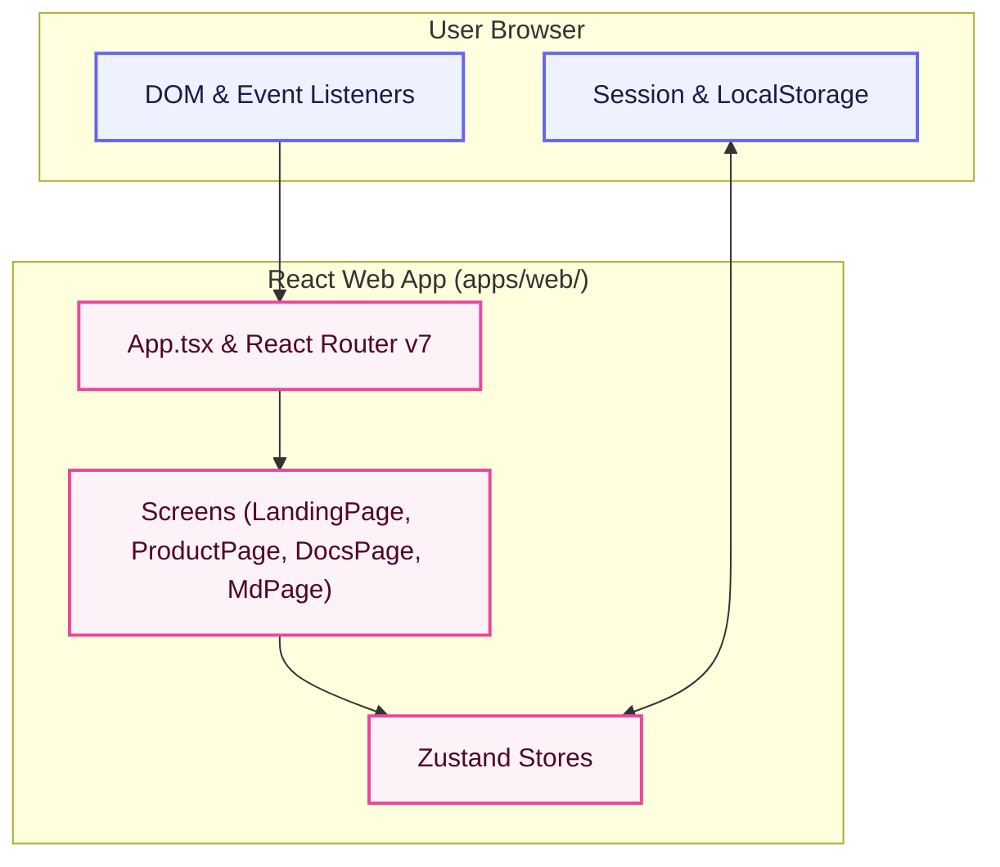

# Telegramonic Web Portal (`apps/web/`)

The web portal for **Telegramonic**—a React-based web application designed for web browsers. It compiles and bundles using **Craco** and uses **Chakra UI v3** alongside **Tailwind CSS** for visual layout. It serves as the marketing landing page, product download center, and documentation viewer (the desktop application in `apps/desktop/` handles server integration and file management).

## Architecture Diagram



---

## Table of Contents

- [Features](#features)
- [Directory Structure](#directory-structure)
- [Tech Stack & Dependencies](#tech-stack--dependencies)
- [How It Works](#how-it-works)
- [Getting Started](#getting-started)
- [Testing](#testing)

---

## Features

- **Product Overview & Download Portal**: Detects user OS dynamically (macOS, Windows, Linux, iOS, Android) to recommend the appropriate installation package. Downloads for Android target the official Google Play Store listing.
- **Interactive Documentation Viewer**: Reads product, architecture, version histories, and credentials/setup guides directly inside the web browser. Supports structured documentation, including the Telegram API Credentials Guide and separate platform version logs for desktop and mobile clients.
- **Legal & Compliance Documents**: Fast rendering of privacy policy, terms of service, disclaimer, FAQ, etc.
- **Smooth Animation Flow**: Fully integrated with Framer Motion for responsive UI element state changes and animations.
- **Seamless Localisation**: Native support for multilingual translation toggling via `i18next` localized string configurations (supporting English, Hindi, Spanish, Russian, Chinese, and Japanese).
- **System Theme Adaptability**: Automatic synchronization between user browser theme parameters (`prefers-color-scheme`) and app dark/light displays.

## Showcase


---

## Directory Structure

```
apps/web/
├── src/
│   ├── App.tsx             # Main React entry point with providers and routes
│   ├── index.tsx           # React DOM bootstrap file (React 18)
│   ├── index.css           # Tailwind CSS directives and global typography
│   ├── components/         # Common display modules and custom themes
│   ├── providers/          # React context wrappers (Query, Chakra, Localization)
│   ├── routes/             # Route configurations and screen loaders
│   ├── screens/            # Screen views (LandingPage, ProductPage, DocsPage, MdPage)
│   ├── store/              # Zustand global application state stores
│   └── __tests__/          # Component, unit, and snapshot test suites
├── public/                 # Static html shell, favicons, and manifest files
├── craco.config.js         # Craco build and webpack settings override configuration
├── tailwind.config.js      # Tailwind utility styling selectors configuration
├── jest.config.js          # Jest test execution options
└── package.json            # Web package scripts, dependencies, and configuration
```

---

## Tech Stack & Dependencies

| Dependency / Tool     | Version | Purpose                                   |
| :-------------------- | :------ | :---------------------------------------- |
| `react` / `react-dom` | ^18.3.1 | Core component rendering engine           |
| `react-router-dom`    | ^7.15.0 | Web page routing and view navigation      |
| `@chakra-ui/react`    | ^3.19.1 | UI library and components framework       |
| `zustand`             | ^5.0.13 | App-wide frontend state management        |
| `framer-motion`       | ^11.3.2 | Component transition and micro-animations |
| `tailwind-css`        | 3.x     | Visual styling tokens and layout classes  |
| `@craco/craco`        | ^7.1.0  | Webpack configuration override layer      |
| `jest` / `ts-jest`    | ^29.7.0 | Test runner and spec assertion suites     |
| `cypress`             | ^13.8.1 | Browser end-to-end user-flow verification |

---

## How It Works

### React Render Loop & State

The frontend mounts the root React node in [`index.tsx`](file:///Users/mr.robot/z-stash/telegramonic/telegramonic/web/src/index.tsx). Global UI states are managed by Zustand stores in the `store/` directory.

### Localized Layouts

The app loads strings dynamically using `react-i18next` hooks to avoid hardcoding text inside pages. Localized copies reside in `@localization/locales/` matching the user's preferred language.

---

## Getting Started

### Prerequisites

- Node.js (v18+)
- Yarn (v4 Berry)

### Run in Development

```bash
# Start the React web app from the monorepo root
yarn web:start
```

The app will open automatically in your browser at `http://localhost:3000`.

### Build for Production

```bash
# Compile and optimize assets
yarn web:build
```

Compiled files will be exported to the `apps/web/build/` directory.

---

## Testing

The project uses Jest for unit/snapshot tests and Cypress for E2E tests.

```bash
# Run unit and snapshot tests
yarn web:test

# Run tests with coverage reporting
yarn workspace telegramonic-web run test:cov

# Open the interactive Cypress E2E test dashboard
yarn workspace telegramonic-web cy:open
```
