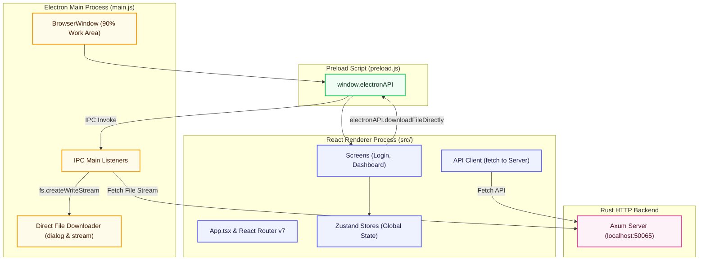

# Telegramonic Desktop Client (`desktop/`)

The desktop client for **Telegramonic**—a React-based user interface wrapped in an **Electron** shell. It connects to the local Rust Axum server via secure IPC tunnels and standard HTTP API requests, presenting a high-performance, dark-themed cloud storage workspace for managing Telegram channels as drives.

## Architecture Diagram



---

## Table of Contents

- [Features](#features)
- [Directory Structure](#directory-structure)
- [Tech Stack & Dependencies](#tech-stack--dependencies)
- [How It Works](#how-it-works)
- [Getting Started](#getting-started)
- [IPC API Reference](#ipc-api-reference)
- [Testing](#testing)

---

## Features

- **Unlimited Telegram Cloud Drives**: Turn your Telegram channels into dedicated cloud storage drives with no file count limits, enabling structured organization of your digital assets.
- **Hierarchical Folder Structure**: Easily create, navigate, and manage nested folders inside your drives to keep files logically categorized.
- **Frictionless Telegram Authentication**: Sign in securely using standard Telegram phone-number verification, instant OTP codes, and 2FA cloud password authorization.
- **Instant Search & Filtering**: Locate files and drives instantly with a real-time responsive search bar that filters as you type.
- **Flexible Grid and List Views**: Switch views on the fly between a visual card board layout for media files and a compact table view for detailed file lists.
- **Reliable Background Uploads**: Upload files with active progress bars that notify you when the file is safely stored on Telegram.
- **Direct Native Downloads**: Download files directly to your computer using native system dialogs and direct-to-disk streaming for optimal download speeds.
- **Automatic System Theme Sync**: An aesthetic interface that automatically adapts to your operating system's dark or light mode color preferences.
- **Mac-Native Visual Polish**: Enjoy a borderless, integrated title bar design on macOS that blends with your native desktop environment.

---

## Directory Structure

```
desktop/
├── src/
│   ├── App.tsx             # Root React component, routing, and provider configuration
│   ├── index.tsx           # React DOM bootstrap file loading React 18
│   ├── index.css           # Global Tailwind and font styles
│   ├── components/         # Reusable presentation and interactive components
│   ├── screens/            # Page-level screen views (loginPage, dashboard)
│   │   ├── loginPage/      # Login layout and authentication inputs
│   │   └── dashboard/      # Slate-blue storage hub dashboard and file explorer
│   ├── services/           # API fetch wrappers and react-query definitions
│   ├── store/              # Zustand global application state stores
│   └── __tests__/          # React component and hook test suites
├── public/                 # Static assets (HTML template, brand icons)
├── main.js                 # Electron main process entry point (window setup, IPC handling)
├── preload.js              # Electron preload contextBridge exposing secure API functions
├── electron-builder.json   # Packaging config for generating macOS/Windows/Linux installers
├── craco.config.js         # Custom webpack, babel, and CRA override configuration
├── jest.config.js          # Testing suite configuration for Jest
└── package.json            # Desktop package dependencies and development scripts
```

---

## Tech Stack & Dependencies

| Dependency / Tool       | Version  | Purpose                                              |
| :---------------------- | :------- | :--------------------------------------------------- |
| `electron`              | ^31.0.0  | Core native desktop application wrapper              |
| `react` / `react-dom`   | ^18.3.1  | Rendering engine for the user interface              |
| `react-router-dom`      | ^7.15.0  | Dynamic page routing and navigation                  |
| `@chakra-ui/react`      | ^3.19.1  | Component design system                              |
| `@tanstack/react-query` | ^5.51.23 | Server state caching and sync                        |
| `zustand`               | ^5.0.13  | Client side state management                         |
| `electron-builder`      | 26.8.1   | Distributable packager for cross-platform installers |
| `@craco/craco`          | ^7.1.0   | Custom builder configuration without ejecting        |
| `jest` / `ts-jest`      | ^29.7.0  | Unit and snapshot testing suites                     |

---

## How It Works

### Process Isolation & Security

The application strictly enforces Electron security best practices. The renderer process runs with `nodeIntegration: false` and `contextIsolation: true`. All native capability access is routed through a secure IPC interface defined in [`preload.js`](file:///Users/mr.robot/z-stash/telegramonic/telegramonic/desktop/preload.js).

### Window Configuration & Sizing

Upon startup, [`main.js`](file:///Users/mr.robot/z-stash/telegramonic/telegramonic/desktop/main.js) queries the user's primary display metrics using Electron's `screen` module. The application window is dynamically sized to **90%** of the screen's available `workAreaSize` and renders with a frameless design on macOS (`titleBarStyle: 'hidden'`).

### Direct File Downloads

To prevent large-file memory issues in Chromium, downloads are intercepted using the custom `download-file-directly` handler:

1. The frontend invokes `electronAPI.downloadFileDirectly(url, filename)`.
2. The main process displays a native `dialog.showSaveDialog` window.
3. If approved, the main process fetches the stream from the Axum Rust server, piping incoming chunks directly to disk via `fs.createWriteStream`.
4. If failed or canceled, any partially written temp files are immediately deleted.

---

## Getting Started

### Prerequisites

- Node.js (v18+)
- Yarn (v4 Berry)

### Run in Development

```bash
# Start the Axum backend first in a separate terminal
yarn server:start

# Start the desktop application from the monorepo root
yarn desktop:start
```

### Compile & Distribute

To build and compile installers for distribution:

```bash
# Compile React application bundle
yarn desktop:build

# Package installer for the host platform (macOS/Windows/Linux)
yarn desktop:dist:mac
yarn desktop:dist:win
yarn desktop:dist:linux

# Package for all platforms concurrently
yarn desktop:dist:all
```

Outputs are saved to the `desktop/dist/` directory.

---

## IPC API Reference

The following functions are exposed to the React frontend on the global `window.electronAPI` object:

| Function Signature                                             | IPC Event / Mechanism             | Description                                                                                    |
| :------------------------------------------------------------- | :-------------------------------- | :--------------------------------------------------------------------------------------------- |
| `platform: string`                                             | `process.platform`                | Identifies the host operating system (`darwin`, `win32`, `linux`).                             |
| `minimize(): void`                                             | `window-minimize` (send)          | Minimizes the desktop window.                                                                  |
| `close(): void`                                                | `window-close` (send)             | Closes the application.                                                                        |
| `checkConnection(): Promise`                                   | HTTP GET check                    | Pings the local Rust server at `127.0.0.1:50065` to determine latency and connectivity status. |
| `setDockIcon(dataUrl: string): void`                           | `set-dock-icon` (send)            | Updates the application icon in the OS dock dynamically (macOS only).                          |
| `downloadFileDirectly(url: string, filename: string): Promise` | `download-file-directly` (invoke) | Streams file content directly to local storage via native OS filesystem streams.               |
| `openExternal(url: string): void`                              | `open-external` (send)            | Safely opens web URLs in the user's default browser.                                           |

---

## Testing

Tests are written in Jest and React Testing Library.

```bash
# Run Jest unit and snapshot tests
yarn web:test

# Run tests with coverage output
yarn workspace telegramonic-desktop run test:cov
```
