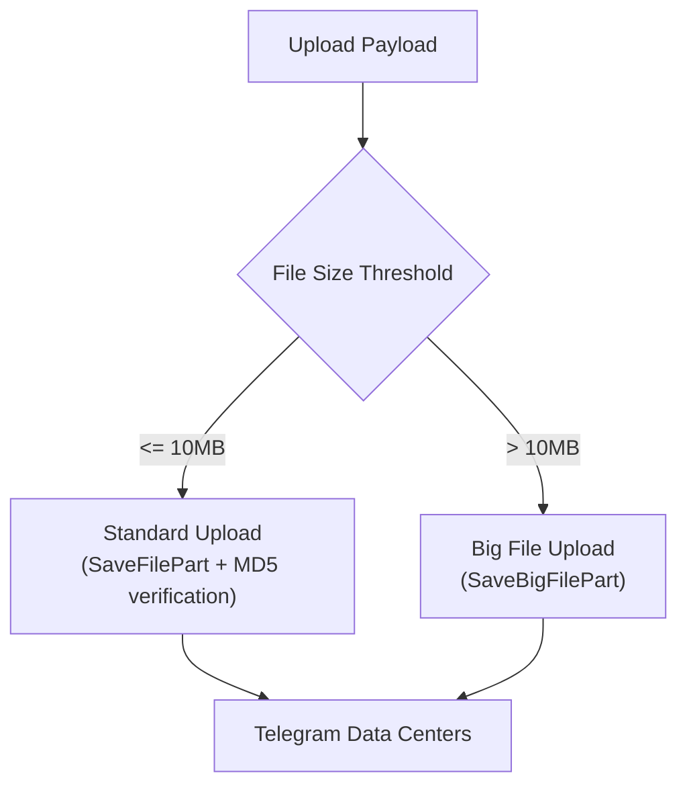
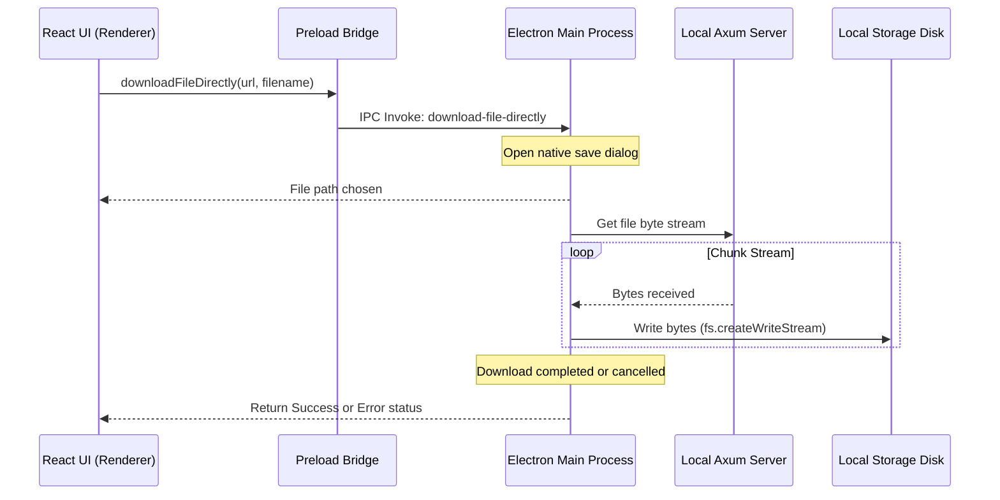

# Direct-to-API Storage & Streaming Engine

Telegramonic does not run storage hardware or maintain database tables for your files. Instead, it acts as an overlay client that interacts directly with Telegram’s message-based file sharing protocol.

---

## 📦 File Chunking & Upload Mechanics

When a file is uploaded, the client interface sends parts of the binary payload to the backend server. The Axum server buffers and streams chunks to Telegram's media servers.

### 1. File Chunk Size

Files are divided into standard chunks of **512 KB** each (the maximum chunk size supported by Telegram).

### 2. Standard Uploads vs. Big Uploads

The backend handles uploads differently depending on file dimensions:

- **Files <= 10 MB**: Standard upload flow using `SaveFilePart`. Each chunk is uploaded along with an MD5 checksum to verify network package integrity.
- **Files > 10 MB**: Large file upload flow using `SaveBigFilePart`. This bypasses MD5 checks to increase transmission speeds. Files up to **2 GB** (or **4 GB** for Telegram Premium accounts) are fully supported.

### 3. Upload Progress Streams (SSE)

While a file is transferring, the server exposes real-time status updates via Server-Sent Events (SSE) at the `/files/upload-progress/stream?file_id=<id>` endpoint. This allows the client UI to render an accurate progress percentage bar.

---

## 🖥️ Direct-to-Disk Desktop Download (IPC)

Standard web browsers download files by buffer-loading the response content into browser memory before compiling it into a file, which creates memory bottlenecks for large files.

The Electron desktop client implements a secure **Direct-to-Disk Streaming Download** that bypasses Chromium's memory footprint entirely:

1.  **IPC Invocation**: The React UI calls `window.electronAPI.downloadFileDirectly(url, filename)`.
2.  **Save Dialog**: Electron's main process displays the native operating system's Save Dialog, prompting the user for a destination file path.
3.  **WriteStream Pipeline**: Once the destination path is selected, the main process establishes an HTTP stream request to the Axum backend (`/files/download?file_id=<id>`). It pipes the incoming response chunk bytes directly into a Node.js `fs.createWriteStream` instance.
4.  **Error Cleanup**: If the download is canceled or fails, the stream is closed, and the partially written temporary file is deleted instantly from the user's hard drive to prevent leaving junk files.
