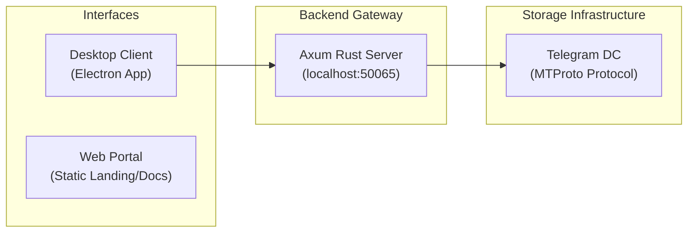

# Introduction to Telegramonic

**Telegramonic** is a high-performance, minimalist cloud storage solution engineered specifically for digital craftsmen, developers, and tech professionals. It delivers a fast, secure, and ergonomic environment to organize and interact with your digital assets.

By directly leveraging Telegram's secure, globally distributed MTProto infrastructure, Telegramonic turns custom channels into custom cloud drives—providing unlimited storage capacity with zero hardware costs, zero database overhead, and absolute privacy.

---

## 🏗️ Architectural Concept

Telegramonic is organized as a unified monorepo divided into four core workspaces to maintain separation of concerns:

- 🖥️ **Desktop Client**: A secure, frameless desktop client wrapped in Electron. It communicates with the local Rust backend to perform drive listings, chunk uploads, streaming downloads, and user login workflows.
- 🌐 **Web Portal**: A browser-based web application serving as the landing page, download portal, and documentation viewer. It operates completely independently of the server.
- ⚙️ **Rust Backend (Axum)**: A lightweight local HTTP gateway that translates REST/SSE APIs from the client into binary MTProto connections directly to Telegram's Data Centers.
- 📦 **Common Resources**: Shared React presentation components, design tokens, asset wrappers, and localizations.

---

## 🎨 Visual Identity & Brand Design

Telegramonic implements a **Modern Corporate / Utility Minimalism** (Terminal-Luxury) visual identity:

- **Dark-First Theme**: High-contrast dark workspaces matched with subtle glassmorphic modals and border-based boundaries.
- **Brand Typography**: [Geist Sans](https://vercel.com/font/sans) for interface copies and `Geist Mono` for structured data, metadata metrics, and console logs.
- **Colors**: Sleek charcoal canvas background (`#15111e`) coupled with deep violet (`#8b5cf6`) accents and status indicators.
- **Responsiveness**: Micro-animations powered by Framer Motion coupled with clean layout alignments.

---

## 🔑 Core Pillars

### 1. Zero-Hardware Storage

No databases, S3 buckets, or storage servers are required. Your data is housed entirely inside your Telegram account, organized into private channels mounted as customized drives.

### 2. High-Performance Transfers

Features parallel multi-part transfers. Files are partitioned into standard **512KB chunks** and uploaded concurrently, pushing transmission rates up to 100MB/s depending on your internet connection.

### 3. Absolute Security & Local Sessions

Authentication credentials and session keys are kept entirely local. The application does not store information on external databases:

- Your session is maintained in `telegram.session` (binary auth key).
- Your API client ID/hash are saved in `telegram.credentials`.
  All data transfers are encrypted in-transit via standard MTProto 2.0.
