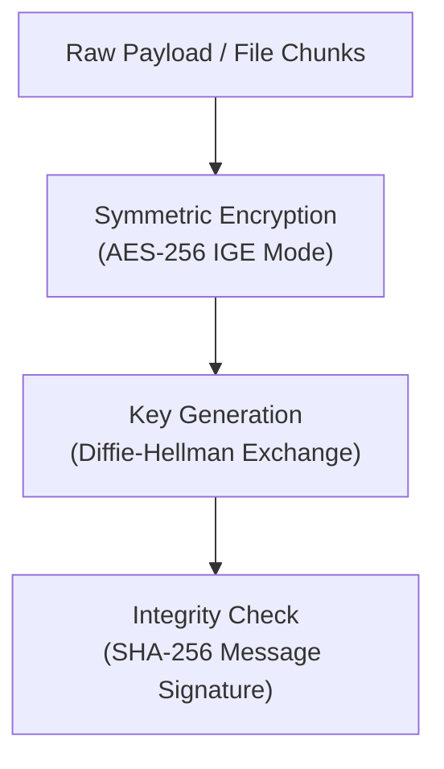
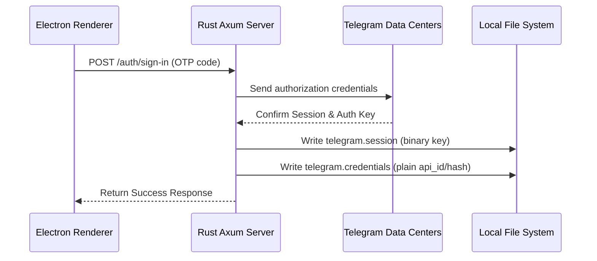

# MTProto Protocol & Session Architecture

Telegramonic utilizes Telegram's official **MTProto 2.0 mobile protocol** to manage transport layers, authentication, and secure data sync. MTProto is designed to run efficiently on high-latency channels and low-bandwidth connections.

---

## 🔒 Cryptographic Implementation

MTProto 2.0 encrypts data in-transit using a layered cryptographic architecture:

- **Symmetric Encryption**: All communication payloads (including file chunks) are encrypted via **AES-256** in **IGE (Infinite Garble Extension)** mode. IGE links cipher block vectors in both directions, making it more resilient to tampering than standard CBC mode.
- **Key Exchange**: Auth keys are negotiated using a secure **Diffie-Hellman (DH)** exchange, ensuring no party can reconstruct the key by eavesdropping on the network.
- **Message Verification**: Employs **SHA-256** checksums computed on the payload to protect against man-in-the-middle injection and payload manipulation.

---

## 💾 Local Session Caching & Files

To maintain absolute user privacy, Telegramonic implements a **Zero-Cloud-Storage** credential architecture. All auth keys and configurations are cached in the host machine's local directory:

- 📁 `telegram.session`: Generated automatically upon successful authentication. It stores the binary MTProto session information (authorization key, IP address/port of connection data center, and session sequence indicators) parsed by the `grammers-session` crate.
- 📁 `telegram.credentials`: Stores the user's `api_id` and `api_hash` values in plain text (separated by a newline). This allows the Rust server to automatically rebuild the Grammers client on restart.

> [!IMPORTANT]
> Both `telegram.session` and `telegram.credentials` are saved in the `apps/server/` root directory and are explicitly configured in `.gitignore`. They are never transmitted, backed up, or shared.
>
> Running `POST /auth/log-out` or `POST /auth/reset-authorization` deletes these files and cleans up the memory instantly.

---

## ⚡ The Grammers Client Layer

Telegramonic leverages the **[Grammers](https://github.com/Lonami/grammers)** Rust crate to manage the client lifecycle:

1.  **Lazy Initialization**: The server starts up without any active MTProto connection.
2.  **Restore attempt**: On startup, the backend searches for `telegram.session` and `telegram.credentials`. If found, it instantly bootstraps a background Tokio loop to reconnect.
3.  **Dynamic Connection**: If files are missing, the server remains in a `LoggedOut` state until the `/auth/send-code` endpoint is triggered, supplying custom API keys.
