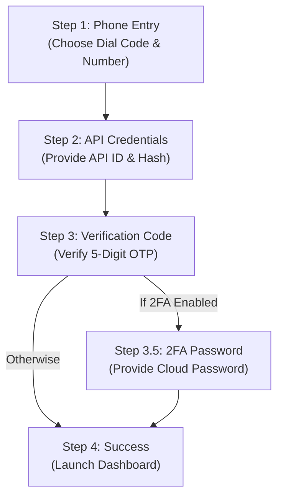

# Quick Start Guide

This guide walks you through setting up and running Telegramonic in minutes. It covers both the end-user authentication wizard and developer workspace commands.

---

## ⚙️ Prerequisites

Before launching Telegramonic, verify you have the following assets:

1. **Telegram Account**: A valid active mobile number associated with a Telegram account.
2. **API Credentials**: Your custom Telegram API identifiers (`api_id` and `api_hash`) generated from [my.telegram.org](https://my.telegram.org).
3. **Developer Environment** (Optional, for running from source):
    *   Node.js (Latest LTS version, 18+)
    *   Yarn 4.x (Berry) package manager
    *   Rust Toolchain (Stable compiler, 2021 edition)

---

## 🖥️ Launching the Application (Developer Setup)

If you are building and testing the monorepo from source, execute the following commands in separate terminals at the root directory:

### Step 1: Install Dependencies
Install all node packages across the workspaces:
```bash
yarn install
```

### Step 2: Launch the Rust Backend Server
Start the Axum backend gateway. This server binds to `127.0.0.1:50065` and acts as the MTProto bridge:
```bash
yarn server:start
```

### Step 3: Launch the Desktop Client
Start the Electron desktop UI. It will automatically detect and communicate with the local Rust gateway:
```bash
yarn desktop:start
```

### Step 4: Run the Web Portal (Optional)
If you wish to view the static marketing landing page and the browser-only documentation:
```bash
yarn web:start
```
The portal opens at `http://localhost:3000`.

---

## 🔑 The Client Authentication Wizard

When launching the desktop application, you are guided through a 4-step secure configuration flow:



### Step 1: Phone Number Input
Enter your phone number. You can search and select your country using the integrated flag/dial-code selector.

### Step 2: Custom API Configuration
Submit your Telegram API Credentials:
*   **API ID** (e.g., `21840291`)
*   **API Hash** (e.g., `d5a9b8cd4e3f...`)

> [!WARNING]
> Never share your API credentials. These parameters are saved locally in the `telegram.credentials` text file inside the backend workspace and are never uploaded to any third-party services.

### Step 3: OTP Verification Code
Telegram will send a **5-digit verification code** to your active Telegram application sessions. Enter this code into the wizard.

### Step 4: Two-Factor Authentication (Optional)
If your Telegram account has Two-Step Verification (2FA) active, you will be prompted to submit your secure account password.

### Step 5: Storage Dashboard
Once logged in successfully, your session is saved inside `telegram.session`. The UI will transition to the storage explorer dashboard, letting you create drives (Telegram channels) and upload/download files.
