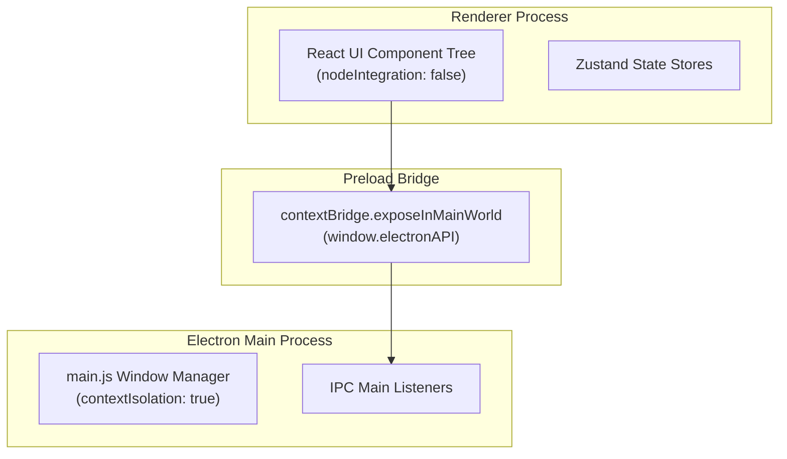

# Monorepo System Design

This document details the system design, monorepo workspaces, and security models of the Telegramonic cloud storage project.

---

## 🏗️ Monorepo Architecture

Telegramonic is structured as a yarn-based monorepo consisting of four workspaces:

```text
telegramonic/
├── common/        # Shared assets, presentation components, localized copy schemas
├── desktop/       # Electron desktop client (React renderer UI + Main process wrapper)
├── web/           # Independent React web portal (Landing page, download center, docs)
└── server/        # Axum Rust backend acting as the MTProto API Gateway
```

---

## 🖥️ Desktop Process Isolation

To ensure security, the Desktop workspace strictly isolates native node tasks from browser rendering loops:



1.  **Renderer Process**: Renders the Chakra UI interface. It is blocked from directly importing Node.js standard modules (`fs`, `path`, `child_process`) to prevent cross-site scripting (XSS) elevation.
2.  **Preload Script (`preload.js`)**: Runs in an isolated execution context. It exposes a strictly limited API window bridge object (`window.electronAPI`) containing safe channels for window control (minimize, close), direct file downloading, and network connection diagnostics.
3.  **Main Process (`main.js`)**: Runs with full native OS capabilities. It listens to IPC invocations, manages system file dialog prompts, and streams download files directly to the user's local disk.

---

## 🌐 Web Portal Independence

Unlike the Desktop App, the browser **Web Portal** operates as a completely static application:
*   It has **no** routes connecting to the Rust server or handling live files/drives.
*   It serves the product landing page, detects user agent strings to recommend platform installations (Windows, macOS, Linux, Android, iOS), and provides this documentation viewer.
*   By maintaining a clean separation between the static web portal and client-side operations, the web workspace is light, secure, and easily hostable on standard static CDNs.

---

## ⚙️ Rust Backend Gateway (Axum)

The backend server is written in Axum (using Tokio runtime) to facilitate concurrent network calls:
*   **Routing**: Defined modularly in `handlers/`. Routes are categorized into `auth`, `users`, `drives`, and `files`.
*   **Service Layer**: Employs the `TelegramService` Rust trait. The system runs in `RealTelegramService` (connecting to MTProto via Grammers), while unit tests utilize `MockTelegramService` for rapid in-memory verification.
*   **Tokio Task Loops**: Grammers client connections are managed on a dedicated tokio background thread to handle MTProto updates, packet keep-alives, and event triggers asynchronously.
