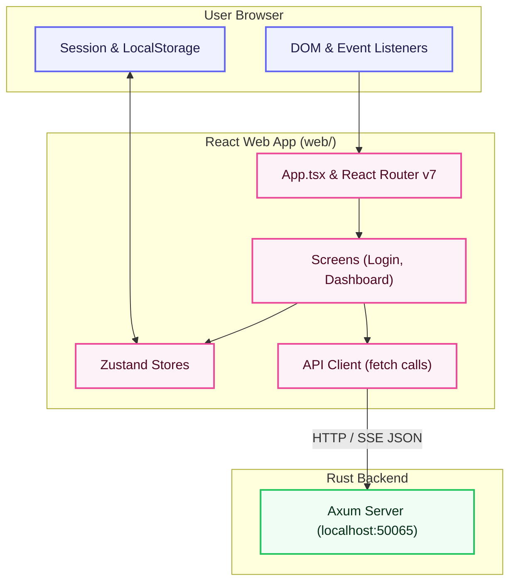

# Telegramonic Web Frontend (`web/`)

The web frontend for **Telegramonic**—a React-based web application designed for web browsers. It compiles and bundles using **Craco** and uses **Chakra UI v3** alongside **Tailwind CSS** for visual layout. It connects directly to the local Axum Rust server running on `localhost:50065` via standard web APIs to manage files and drives.

## Architecture Diagram



---

## Table of Contents

- [Features](#features)
- [Directory Structure](#directory-structure)
- [Tech Stack & Dependencies](#tech-stack--dependencies)
- [How It Works](#how-it-works)
- [Getting Started](#getting-started)
- [Testing](#testing)

---

## Features

- **Unlimited Telegram Cloud Drives**: Mount Telegram channels as custom drives, using them for storing, displaying, and managing files in the cloud.
- **Visual Folder & File Board**: Create, rename, or delete directories and explore files using a layout optimized for browser interactions.
- **Instant Search & Query Filters**: Quickly find drives and files using dynamic, real-time client-side search.
- **Double View Layout**: Switch between dynamic grid cards for visual files and compact tables for structured metadata.
- **Progressive Upload Indicator**: Interactive progress bars track file chunk buffer states directly in the web browser.
- **Smooth Animation Flow**: Fully integrated with Framer Motion for responsive UI element state changes and animations.
- **Seamless Localisation**: Native support for multilingual translation toggling via `i18next` localized string configurations.
- **System Theme Adaptability**: Automatic synchronization between user browser theme parameters (`prefers-color-scheme`) and app dark/light displays.

---

## Directory Structure

```
web/
├── src/
│   ├── App.tsx             # Main React entry point with providers and routes
│   ├── index.tsx           # React DOM bootstrap file (React 18)
│   ├── index.css           # Tailwind CSS directives and global typography
│   ├── components/         # Common display modules and custom themes
│   ├── data/               # Static dataset files
│   ├── providers/          # React context wrappers (Query, Chakra, Localization)
│   ├── routes/             # Route configurations and screen loaders
│   ├── screens/            # Screen views (dashboard, loginPage)
│   ├── services/           # HTTP API client fetch structures
│   ├── store/              # Zustand global application state stores
│   └── __tests__/          # Component, unit, and snapshot test suites
├── public/                 # Static html shell, favicons, and manifest files
├── craco.config.js         # Craco build and webpack settings override configuration
├── tailwind.config.js      # Tailwind utility styling selectors configuration
├── jest.config.js          # Jest test execution options
└── package.json            # Web package scripts, dependencies, and configuration
```

---

## Tech Stack & Dependencies

| Dependency / Tool | Version | Purpose |
|:---|:---|:---|
| `react` / `react-dom` | ^18.3.1 | Core component rendering engine |
| `react-router-dom` | ^7.15.0 | Web page routing and view navigation |
| `@chakra-ui/react` | ^3.19.1 | UI library and components framework |
| `@tanstack/react-query`| ^5.51.23| Remote query caching and resource synchronization |
| `zustand` | ^5.0.13 | App-wide frontend state management |
| `framer-motion` | ^11.3.2 | Component transition and micro-animations |
| `tailwind-css` | 3.x | Visual styling tokens and layout classes |
| `@craco/craco` | ^7.1.0 | Webpack configuration override layer |
| `jest` / `ts-jest` | ^29.7.0 | Test runner and spec assertion suites |
| `cypress` | ^13.8.1 | Browser end-to-end user-flow verification |

---

## How It Works

### React Render Loop & State
The frontend mounts the root React node in [`index.tsx`](file:///Users/mr.robot/z-stash/telegramonic/telegramonic/web/src/index.tsx). Global application variables (e.g. workspace settings, connection status) are managed by Zustand stores in the `store/` directory. API data caching is handled by React Query to prevent redundant network lookups.

### Localized Layouts
The app loads strings dynamically using `react-i18next` hooks to avoid hardcoding text inside pages. Localized copies reside in `web/src/localization/locales/` matching the user's preferred language.

### Server Connection
The client communicates directly with the local Axum Rust API server over standard HTTP. Communication is configured to bind to `127.0.0.1:50065`.

---

## Getting Started

### Prerequisites
- Node.js (v18+)
- Yarn (v4 Berry)

### Run in Development

```bash
# Start the Axum backend first in a separate terminal
yarn server:start

# Start the React web app from the monorepo root
yarn web:start
```

The app will open automatically in your browser at `http://localhost:3000`.

### Build for Production

```bash
# Compile and optimize assets
yarn web:build
```

Compiled files will be exported to the `web/build/` directory.

---

## Testing

The project uses Jest for unit/snapshot tests and Cypress for E2E tests.

```bash
# Run unit and snapshot tests
yarn web:test

# Run tests with coverage reporting
yarn workspace telegramonic-web run test:cov

# Open the interactive Cypress E2E test dashboard
yarn workspace telegramonic-web cy:open
```
